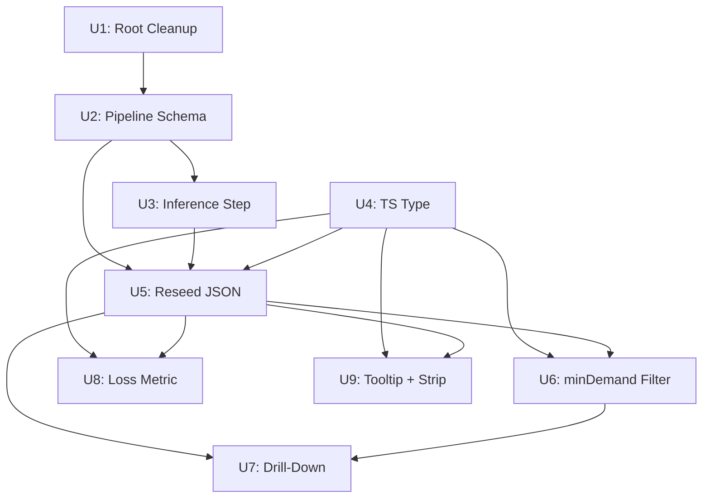

# feat: Ticket Ticker Phase 2 — Data Quality, Schema Enrichment, and Drill-Down

## Summary

Three sequential tracks delivered as separate PRs (C→A→B): root folder cleanup, Python pipeline and JSON schema migration (split `event`/`location`, add price inference and provenance fields, reseed from the Expanded CSV), and React chart updates (minDemand filter bar, artist→city drill-down with breadcrumb, loss metric fix using `original_price_inferred`, tooltip enrichment). The existing `components/TicketTickerChart.tsx` and `scripts/ticket_ticker/` pipeline are extended, not replaced.

---

## Problem Frame

Covered in detail by the origin document. In summary: the MVP chart is undermined by loss metrics computed from only ~35% of SELL records, event name fragmentation that prevents artist-level aggregation, micro-event noise on first load, and pipeline checkpoint files scattered across the project root. This plan resolves all four in one branch.

*(see origin: docs/brainstorms/2026-06-16-ticket-ticker-phase2-requirements.md)*

---

## Requirements

- R1. Project root contains no `extracted_*.json`, CSV, ZIP, handoff doc, or phantom `node_modules` artifacts (C1–C5)
- R2. `content/ticket-ticker.json` uses the new 11-field schema: `event` (artist/festival name only), `location`, `event_date`, `type`, `price`, `original_price_inferred`, `price_inference_source`, `num_tickets`, `category`, `message_date`, `message_hash` (A1, A2, A6, A7)
- R3. ≥85% of SELL records in the reseeded JSON have a non-null `original_price_inferred` (A1, A5)
- R4. Pipeline no longer appends city to event names; `location` is a separate field in all new output (A3, A4)
- R5. Dataset inference fills `original_price_inferred` for SELL records missing an explicit value, marking source as "dataset" (A5)
- R6. On page load without interaction, chart shows only events with ≥40 buy requests; a minDemand control is visible in the filter bar (B1)
- R7. Clicking an artist bubble enters city-level drill-down with a breadcrumb; clicking the root breadcrumb returns to artist view; single-city artists also enter drill-down (B2–B5)
- R8. Loss metric uses `original_price_inferred`; events with no price coverage appear at Y=0 with distinct visual treatment (reduced opacity + dashed stroke) and a legend note (B6, B7)
- R9. Tooltip shows event date (when available), sell count, and a loss coverage note when `avgLossValid = false` (B8)
- R10. Source strip on the project page reflects the full date range Nov 2023 – Jun 2026 (B9)

**Origin actors:** A1 (Arnav, data operator), A2 (Reader, public explorer)

**Origin acceptance examples:**
- AE-A1 → R3 (≥85% SELL records with non-null `original_price_inferred`)
- AE-A2 → R4 (`event = "Coldplay"`, `location = "Mumbai"`)
- AE-B1 → R6 (chart loads with minDemand=40 applied; control visible)
- AE-B2 → R7 (Coldplay drill-down shows 3–4 city sub-bubbles; breadcrumb works)
- AE-B3 → R8 (no-data bubbles at Y=0 with distinct visual; legend note)

---

## Scope Boundaries

- Manual QC price overrides (`Manual QC Price`, `QC Inferred Price`, `Manual QC Date` columns in Expanded CSV) — Colab-specific; not replicated
- `price_map` inference for new post-Jan-27 events — not ported; deferred
- Personal data fields (`sender_name`, `original_message`, `source_file`) — excluded from output schema
- Chart view type switchers (supply/demand ratio, price over time, category breakdown) — still deferred per Phase 1
- Shareable filter URLs, saved state, user accounts — still deferred
- Automated ingestion — still laptop-triggered only
- Post-Jan-27 records will have `location = null` and `event_date = null` initially; full re-extraction is deferred

### Deferred to Follow-Up Work

- Re-extraction of Jan 27 – Jun 2026 WhatsApp data with updated pipeline (to populate `location` and `event_date` for those records): future pipeline run, separate from this branch
- `price_map` implementation for new events: requires a maintained face-value lookup table; separate task

---

## Context & Research

### Relevant Code and Patterns

- `components/TicketTickerChart.tsx` — current chart; 5 state values (`eventFilter`, `startDate`, `endDate`, `hoveredEvent`, `clickedEvent`); `useMemo` groups by `r.event` (exact string key); aggregation computes `buys`, `lossSum/lossCount` (from `r.originalPrice`), `priceSum/priceCount` per group; SVG uses CSS vars directly (no `useTheme` call)
- `scripts/ticket_ticker/pipeline.py` — `to_compact_record()` is the sole definition of the output JSON shape; `--seed` mode reads a CSV and produces the JSON; 4-stage flow (load → extract → cleanup → export). The extraction prompt already requests `location` and `event_date` as separate fields — `to_compact_record()` currently discards them
- `scripts/ticket_ticker/config.py` — `ARTIST_MAP` (35 entries), `FESTIVAL_MAP` (27 entries), `CITY_MAP` (10 cities); single source of truth for normalization; city-append logic is baked into `normalize_event_name()` via a flag
- `scripts/ticket_ticker/utils.py` — `normalize_event_name()` currently returns `f"{canonical} {city}"` for artist entries; `message_hash()` computes MD5 of `normalize(sender)|normalize(content)`
- `scripts/ticket_ticker/renorm.py` — re-applies normalization to existing JSON records using the `event` field only (compact JSON has no `original_message`, so city re-inference from full context is unavailable by design)
- `lib/ticket-ticker.ts` — `TicketRecord` interface (7 fields) and `getTicketRecords()` (static file read at build time; must not be imported inside `'use client'` components)
- `content/ticket-ticker.json` — 16,590 records; current 7-field compact schema; `originalPrice` is the field being renamed

### Institutional Learnings

- **Tailwind v4 dual-token rule** (`docs/solutions/conventions/tailwind-v4-dual-token-palette-update-2026-06-12.md`): any new CSS color token must be registered in `@theme {}`, `:root {}`, and `.dark {}` in `globals.css` simultaneously — missing one block causes silent color splits with no build error
- **SVG filter gating** (`docs/solutions/design-patterns/homepage-hero-graph-flat-constellation-2026-06-03.md`): gate expensive SVG filters via a computed variable (`const filter = isMobile ? undefined : 'url(#x)'`); keep `<defs>` unconditional; only conditionally apply the filter attribute
- **`useTheme` mounted guard**: not currently needed in `TicketTickerChart.tsx` (uses CSS vars directly via SVG attributes). Do not introduce `useTheme` without the `mounted` guard — SSR returns `undefined` and locks the component to light-mode permanently
- **`message_hash` stability**: the MD5 computation (`normalize(sender)|normalize(content)`) must not change across Phase 2 — dedup continuity for incremental pipeline runs depends on it

---

## Key Technical Decisions

- **`to_compact_record()` is the schema boundary**: all new output fields are added there; `lib/ticket-ticker.ts`'s `TicketRecord` interface must be kept in sync manually (no codegen) *(see origin: Key Decisions)*
- **Post-Jan-27 records migrated in-place**: the reseed script reads the Expanded CSV for the Nov 2023–Jan 27 baseline and reads the current JSON to extract post-Jan-27 records, converting `originalPrice` → `original_price_inferred` and padding `location`, `event_date`, `num_tickets` as null; re-extraction is deferred *(see origin: Dependencies / Assumptions)*
- **Null `location` in drill-down → "Unknown" bucket**: records with `location = null` contribute to a synthetic city bubble rather than being silently excluded; demand is conserved and the bucket is visually labeled as unknown origin
- **`minDemand` is artist-view-only**: the 40-demand threshold filters the top-level artist chart; city sub-bubbles in drill-down are not filtered (users clicked through deliberately)
- **Drill-down is `drillDownArtist: string | null` state**: null = artist view (groupBy: `event`, minDemand applied); non-null = drill-down view (groupBy: `event + location`, filtered to `drillDownArtist`, minDemand not applied). Pure client-side re-aggregation — no fetch, no URL state *(see origin: Key Decisions)*
- **`avgLossValid = false` visual treatment**: 40% opacity + `strokeDasharray` dashed stroke on the SVG bubble; the `avgLossValid` flag already exists in the aggregation output *(see origin: B7)*
- **Dataset inference (A5) over price_map**: price_map requires a maintained face-value lookup table not yet ported; dataset inference (copy `original_price` from an explicit SELL record for the same `event + category`) is simpler and covers the majority gap *(see origin: Key Decisions)*

---

## Open Questions

### Resolved During Planning

- **How to handle post-Jan-27 records during reseed?** Null-pad to new schema (accept null for `location`/`event_date`); re-extraction deferred *(see origin: Dependencies / Assumptions)*
- **Does the extraction prompt need updating for A3?** No — the prompt already extracts `location` and `event_date` as separate fields. Only `to_compact_record()` and `normalize_event_name()` need to stop discarding/fusing city.
- **What happens to `originalPrice` in migrated post-Jan-27 records?** Renamed to `original_price_inferred`; `price_inference_source` set to "explicit" where value was non-null, null otherwise.

### Deferred to Implementation

- **Slider vs. number input for minDemand control**: requirements permit either; implementer picks based on filter bar layout
- **Aggregation strategy when multiple explicit prices exist for the same `event + category` pair in dataset inference**: first-found or average — implementer decides and documents in a comment
- **Display label for null-location drill-down bucket**: "Unknown" is the working label; implementer may adjust

---

## High-Level Technical Design

> *This illustrates the intended approach and is directional guidance for review, not implementation specification. The implementing agent should treat it as context, not code to reproduce.*

### Chart State Machine (Track B)

```
drillDownArtist = null                drillDownArtist = "Coldplay"
┌──────────────────────────┐          ┌────────────────────────────────────┐
│  ARTIST VIEW             │  click   │  DRILL-DOWN VIEW                   │
│  groupBy: event          │ ───────→ │  groupBy: event + location         │
│  minDemand = 40 applied  │  bubble  │  filter: event = drillDownArtist   │
│  breadcrumb: hidden      │          │  minDemand: NOT applied            │
│                          │          │  breadcrumb: ALL ARTISTS › COLDPLAY│
└──────────────────────────┘          └────────────────────────────────────┘
            ↑                                          │
            └──────── click "ALL ARTISTS" breadcrumb ─┘
```

### JSON Reseed Merge Strategy (Track A — U5)

```
Expanded CSV (Nov 2023 – Jan 27)       Current JSON (post-Jan-27 only)
  ↓  --seed, new schema                  ↓  filter: message_date > 2026-01-27
  new-schema baseline records            migrate: originalPrice → original_price_inferred
  ↓  run inference step (U3)             pad: location=null, event_date=null, num_tickets=null
                                         price_inference_source: "explicit" or null
         └─────── merge, dedup by message_hash ────────┘
                              ↓
               content/ticket-ticker.json (new schema, ~16,590 records)
```

---

## Implementation Units



---

### U1. Root Folder Cleanup

**Goal:** Remove stray pipeline artifacts and phantom directories from the project root; move source data files to `scripts/ticket_ticker/data/`; move the handoff doc to `docs/`; update `.gitignore`.

**Requirements:** R1

**Dependencies:** None

**Files:**
- Create: `scripts/ticket_ticker/data/` (new directory)
- Move into `scripts/ticket_ticker/data/`: `Ticket ticker - Expanded 27 Jan.csv`, `Ticket ticker - [DO NOT EDIT] Master 27 Jan.csv`, `WhatsApp Chat - 1 - Concert ticket buying selling 😎🔥 Bombay.zip`
- Move: `ticket_ticker_technical_handoff.md` → `docs/ticket_ticker_technical_handoff.md`
- Delete: all `extracted_*.json` and `failed_chunks_*.json` files in root (22 files; already gitignored, disk-only)
- Delete: `node_modules 2/` (phantom duplicate directory)
- Modify: `.gitignore`

**Approach:**
- Inspect `node_modules 2/` contents before deletion to confirm it has no unique files (expected: it is a phantom duplicate of `node_modules/`).
- Delete checkpoint files and phantom directory with shell `rm`.
- `mkdir -p scripts/ticket_ticker/data` then move the three data files.
- Move handoff doc to `docs/`.
- Add `scripts/ticket_ticker/data/` to `.gitignore` to keep CSVs and ZIP untracked (they are large personal data files). Ensure the pattern does not accidentally exclude Python source files in `scripts/ticket_ticker/`.

**Patterns to follow:** Existing `.gitignore` structure and comment style

**Test scenarios:**
- Verification: `git status` shows no untracked stray files in the project root after cleanup.
- Verification: `ls scripts/ticket_ticker/data/` lists the Expanded CSV, Master CSV, and WhatsApp ZIP.
- Verification: `docs/ticket_ticker_technical_handoff.md` exists; the root copy is gone.
- Edge: `.gitignore` addition pattern covers CSVs and ZIP in the new `data/` subdirectory but does not gitignore Python scripts in `scripts/ticket_ticker/`.
- Edge: `node_modules 2/` is fully removed; `node_modules.nosync/` (the symlink target) is untouched.

**Verification:** `git status` shows only intended file moves (tracked as delete + add). Root directory lists no pipeline artifacts, CSV/ZIP files, or phantom `node_modules` directories.

---

### U2. Python Pipeline Schema Updates

**Goal:** Update the Python pipeline to emit `location` as a separate field, stop appending city to event names, and produce the new 11-field output schema via `to_compact_record()`.

**Requirements:** R2, R4

**Dependencies:** U1 (data files in `scripts/ticket_ticker/data/` for pipeline test runs)

**Files:**
- Modify: `scripts/ticket_ticker/config.py`
- Modify: `scripts/ticket_ticker/utils.py`
- Modify: `scripts/ticket_ticker/pipeline.py`
- Modify: `scripts/ticket_ticker/renorm.py`

**Approach:**
- `config.py`: remove the city-suffix flag (or behavior) from ARTIST_MAP and FESTIVAL_MAP entries. Canonical names should be artist/festival name only — no city appended.
- `utils.py`: update `normalize_event_name()` to return `(canonical_name, city_or_null)` as a tuple instead of a single `"canonical city"` string. The caller (`cleanup_records()`) handles both values and passes `location` to the record separately.
- `pipeline.py — to_compact_record()`: add `location`, `event_date`, `original_price_inferred`, `price_inference_source`, `num_tickets` to the output dict. Remove `originalPrice`. The extraction prompt already produces these fields — stop discarding them at the compact-record step.
- `pipeline.py — cleanup_records()`: update the call to `normalize_event_name()` to receive the tuple return and assign `location` on the record.
- `renorm.py`: handle the new schema fields when re-applying maps. Update the `normalize_event_name(pseudo)` call site to unpack the tuple: `canonical, city = normalize_event_name(pseudo)` — the function now returns `(canonical_name, city_or_null)`. Assign `r['event'] = canonical`. Note: after the ARTIST_MAP change, event name strings no longer contain a city token, so `renorm.py` cannot re-infer `location` for existing compact records (the city was in the full message, which isn't stored in compact JSON). Document this limitation in a comment; do not attempt city re-inference from the event name string.

**Patterns to follow:** Existing `cleanup_records()` call pattern; ARTIST_MAP structure in `config.py`

**Test scenarios:**
- Happy path: `normalize_event_name("Coldplay", "Mumbai show")` → returns `("Coldplay", "Mumbai")`, not `("Coldplay Mumbai", None)`. Covers AE-A2 at the normalization level.
- Happy path: `to_compact_record()` on an extracted record → output dict contains `location`, `event_date`, `original_price_inferred`, `price_inference_source`, `num_tickets`; does not contain `originalPrice`.
- Edge: artist with no city detected in text → `location = null`, `event = "Coldplay"` (not `"Coldplay null"`).
- Edge: running `renorm.py` on a sample of old-schema records → `event` field updated to artist-only; `location` updated where re-inferrable from the event name string.
- Error path: ARTIST_MAP entry without a matched city → function returns `(canonical, None)` without raising; no `KeyError` or `f"{canonical} None"` in output.

**Verification:** Running `pipeline.py --seed` on a sample batch produces records where `event` contains no city suffix and `location` is a separate string or null. The 35-entry ARTIST_MAP is spot-checked (Coldplay, Diljit, Arijit) for correct canonical names.

---

### U3. Dataset Inference Step

**Goal:** After extraction, fill `original_price_inferred` for SELL records missing it by copying from an explicit SELL record for the same `event + category` pair.

**Requirements:** R3, R5

**Dependencies:** U2 (new schema must be in place; inference references `event`, `category`, `original_price_inferred`, `price_inference_source`)

**Files:**
- Modify: `scripts/ticket_ticker/pipeline.py`

**Approach:**
- Add an inference pass between the cleanup stage and the export stage (Stage 3.5).
- Build a lookup index: for each `(event, category)` pair, collect `original_price_inferred` values where `price_inference_source = "explicit"`.
- For each SELL record with `original_price_inferred = null`: look up `(r.event, r.category)` in the index. If a match exists, copy the price and set `price_inference_source = "dataset"`. If no match, leave null.
- BUY records are unaffected by this pass.
- The inference pass runs over the in-memory record list after cleanup; it does not re-call the Claude API.

**Patterns to follow:** Existing stage-based pipeline structure in `pipeline.py`; inference logic replicates the Colab "dataset" method described in the origin doc

**Test scenarios:**
- Happy path: SELL record for `event="Coldplay"`, `category="GA"` with `original_price_inferred = null`, given another SELL record for the same pair with `price_inference_source = "explicit"` → inference fills it; source set to "dataset".
- Edge: no explicit records for `(event, category)` pair → record remains `original_price_inferred = null`; no error.
- Edge: multiple explicit records for the same pair with different prices → implementer documents the aggregation choice (first-found or average) in a comment.
- Error path: BUY records are not passed through the inference fill; their `original_price_inferred` stays null.
- Edge: record with `category = null` → `(event, None)` used as key; only matches other null-category records.

**Verification:** After running the full pipeline (U2 + U3) over the Expanded CSV, the fraction of SELL records with non-null `original_price_inferred` is ≥85%. This can be verified by counting in the output JSON before the reseed commit.

---

### U4. TypeScript Type Update

**Goal:** Update `TicketRecord` in `lib/ticket-ticker.ts` to match the new 11-field JSON schema; remove `originalPrice`.

**Requirements:** R2

**Dependencies:** None (can proceed in parallel with U2/U3; must complete before U5, U6, U8, U9 touch frontend code)

**Files:**
- Modify: `lib/ticket-ticker.ts`

**Approach:**
- Add to `TicketRecord`: `location: string | null`, `event_date: string | null`, `original_price_inferred: number | null`, `price_inference_source: 'explicit' | 'dataset' | 'price_map' | null`, `num_tickets: number | null`.
- Remove `originalPrice: number | null`.
- `message_hash` remains absent from `TicketRecord` — it is an internal dedup key not exposed to the frontend.
- `getTicketRecords()` casts parsed JSON to `TicketRecord[]` without runtime validation — no change needed there.
- After removing `originalPrice`, TypeScript will surface compile errors at every callsite that references it (`TicketTickerChart.tsx` aggregation). Those callsites are fixed in U8; this unit just changes the type.

**Patterns to follow:** Existing `TicketRecord` interface structure; no `any` types without a comment (AGENTS.md)

**Test scenarios:**
- Happy path: `next build` (or `tsc --noEmit`) completes after both this unit and U8 are applied — the intentional callsite breaks from removing `originalPrice` resolve in U8.
- Edge: `price_inference_source` union covers `'explicit' | 'dataset' | 'price_map' | null` — a value like `"inferred"` would produce a TypeScript error, correctly rejecting unexpected values.

**Verification:** `TicketRecord` interface no longer has `originalPrice`; new fields appear with correct types. TypeScript compile errors from `originalPrice` callsites are expected until U8 is applied.

---

### U5. Reseed content/ticket-ticker.json

**Goal:** Replace `content/ticket-ticker.json` with a new-schema file seeded from the Expanded CSV and merged with null-padded post-Jan-27 records.

**Requirements:** R2, R3

**Dependencies:** U2 (pipeline outputs new schema), U3 (inference step fills price gaps), U4 (TypeScript type is updated so downstream units can build cleanly)

**Files:**
- Modify: `scripts/ticket_ticker/pipeline.py` (seed mode merge logic)
- Modify: `content/ticket-ticker.json` (output — committed after the run)

**Approach:**
1. Update the `--seed` mode in `pipeline.py` to support the merge strategy:
   - Read the Expanded CSV from `scripts/ticket_ticker/data/` → produce new-schema records for Nov 2023–Jan 27.
   - Run the inference step (U3) over these records.
   - Read the current `content/ticket-ticker.json` and extract records with `message_date > "2026-01-27"`.
   - Migrate old-schema post-Jan-27 records: rename `originalPrice` → `original_price_inferred`; set `price_inference_source` = "explicit" where value was non-null, null otherwise; pad `location = null`, `event_date = null`, `num_tickets = null`.
   - Deduplicate the merged set by `message_hash` (CSV baseline takes precedence for any hash collision with old records).
2. Run the updated seed mode and commit the output file.

**Patterns to follow:** Existing `_csv_row_to_pipeline_record()` and `--seed` flow in `pipeline.py`; existing dedup-by-`message_hash` logic

**Test scenarios:**
- Covers AE-A1: count SELL records in output JSON where `original_price_inferred != null` → must be ≥85% of total SELL records.
- Covers AE-A2: sample 10 Coldplay records in output JSON → `event = "Coldplay"`, `location = "Mumbai"` / `"Ahmedabad"` / `"Delhi"` (not `"Coldplay Mumbai"`).
- Edge: post-Jan-27 records appear in output with `location = null`, `event_date = null`, `num_tickets = null`.
- Edge: no duplicate `message_hash` values in output (spot-check or full scan).
- Edge: CSV contains a stray repeated-header row where `message_date == 'message_date'` — `run_seed()` must skip rows where `message_date` is not a valid YYYY-MM-DD string before processing.
- Edge: within-CSV duplicate records (same `message_hash`) are deduplicated via a hash-based dedup pass in `run_seed()` before the merge step, not relying on the absent `is_duplicate` column.
- Edge: total record count is in range 16,000–17,500 (no mass data loss or duplication).
- Integration: `next build` completes without JSON parse errors after the reseed commit.

**Verification:** Output JSON is valid JSON; SELL coverage ≥85%; Coldplay records show city in `location` field; post-Jan-27 records present and null-padded; `next build` succeeds.

---

### U6. minDemand Filter Bar

**Goal:** Add a `minDemand` filter (default 40) to the chart, shown as a control in the filter bar, filtering artist-view bubbles that fall below the threshold.

**Requirements:** R6

**Dependencies:** U4 (TypeScript type updated), U5 (new JSON data in place)

**Files:**
- Modify: `components/TicketTickerChart.tsx`

**Approach:**
- Add `minDemand: number` state initialized to 40.
- In the `useMemo` aggregation, after computing `buys` per event group, filter out groups where `buys < minDemand` when `drillDownArtist === null` (artist view). Do not filter in drill-down mode.
- Render a control in the existing filter bar section: a slider or number input labeled "Min demand" showing the current value. Implementer picks the control type based on filter bar layout.
- Control updates `minDemand` state; chart re-renders reactively via `useMemo` dependency.
- Update the existing `clearAll()` function to also call `setMinDemand(40)`. Update the `hasActiveFilter` guard (which determines whether "Clear all" appears) to include `|| minDemand !== 40`.

**Patterns to follow:** Existing filter bar state pattern (`eventFilter`, `startDate`, `endDate` useState values); Tailwind token classes for control styling

**Test scenarios:**
- Covers AE-B1: page loads with no interaction → chart shows only events with ≥40 buy requests; "Min demand" control is visible with value 40.
- Happy path: setting `minDemand = 1` → all events including 1–2 demand micro-events are visible.
- Happy path: increasing `minDemand` reduces visible bubble count.
- Edge: `minDemand = 0` → all events shown (no filter applied).
- Edge: `minDemand` set higher than any event's demand → chart shows zero bubbles; no crash or layout breakage.

**Verification:** Page loads with ≤~60 visible bubbles (artist view, minDemand=40). Control shows value 40. Adjusting the control updates the chart in real time without a full re-render.

---

### U7. Artist→City Drill-Down Interaction

**Goal:** Clicking an artist bubble enters city-level sub-aggregation with a breadcrumb; clicking the breadcrumb root returns to artist view. Single-city artists also enter drill-down. Records with null location appear as an "Unknown" city bubble.

**Requirements:** R7

**Dependencies:** U5 (new `location` field in JSON), U6 (minDemand filter — must be in place since drill-down bypasses it)

**Files:**
- Modify: `components/TicketTickerChart.tsx`

**Approach:**
- Add `drillDownArtist: string | null` state initialized to null.
- Bubble `onClick` handler in artist view: set `drillDownArtist = event`. Clear `clickedEvent` and `hoveredEvent` on drill-down entry to avoid stale tooltip state.
- `useMemo` aggregation when `drillDownArtist !== null`: filter records to `r.event === drillDownArtist`, then group by `r.location ?? "Unknown"`. The minDemand filter is skipped. Each `(location | "Unknown")` key becomes one sub-bubble.
- Breadcrumb row: render above the SVG when `drillDownArtist !== null`. Shows "ALL ARTISTS › [ARTIST NAME]". "ALL ARTISTS" is a button that sets `drillDownArtist = null`.
- Sub-bubble click: city sub-bubbles retain the existing click-to-pin-tooltip behavior (setting `clickedEvent`) — no deeper navigation occurs. This preserves keyboard tooltip access in drill-down.
- Chart axes in drill-down: re-computed from the filtered dataset (city-level records for the artist only). Scales are not locked to the full artist-view domain.
- minDemand filter is not applied in drill-down even if set to 40.
- The "ALL ARTISTS" breadcrumb must use a native `<button>` element (or `role="button"` + `tabIndex={0}` + `onKeyDown` Enter/Space) to be keyboard-accessible, matching the existing bubble interaction pattern.
- The back-navigation handler (clicking "ALL ARTISTS") must also call `setClickedEvent(null)` and `setHoveredEvent(null)` to clear any stale drill-down tooltip state.
- Update `clearAll()` to also call `setDrillDownArtist(null)`. Update `hasActiveFilter` to include `|| drillDownArtist !== null`.
- Update the SVG container `aria-label` when `drillDownArtist !== null`: e.g., `"City breakdown for [artist]: N cities by demand and seller loss"`.

**Patterns to follow:** Existing `useMemo` aggregation shape; existing `clickedEvent` / `hoveredEvent` click state pattern

**Test scenarios:**
- Covers AE-B2: clicking Coldplay bubble → chart shows 3–4 city sub-bubbles; breadcrumb reads "ALL ARTISTS › COLDPLAY"; clicking "ALL ARTISTS" resets to full artist view with minDemand reapplied.
- Happy path: breadcrumb back navigation resets `drillDownArtist = null`; artist view re-renders with minDemand=40.
- Happy path: single-city artist click → drill-down with one city bubble shown; breadcrumb visible; back works.
- Edge: records with `location = null` appear as "Unknown" sub-bubble in drill-down — not excluded from the chart.
- Edge: minDemand=40 does not hide city sub-bubbles even when a city has < 40 demand for that artist.
- Integration: re-aggregation from click event to rendered update completes in < 100ms (pure in-memory `useMemo` re-computation; no fetch).

**Verification:** Coldplay drill-down shows city sub-bubbles and breadcrumb. Back navigation returns to artist view with minDemand still applied. Artists with only one city still show the breadcrumb on drill-down entry.

---

### U8. Loss Metric Fix and Visual Distinction

**Goal:** Compute `avgLoss` using `original_price_inferred` (replacing `originalPrice`); render events with no loss data at Y=0 with distinct visual treatment; add a legend note.

**Requirements:** R8

**Dependencies:** U4 (TypeScript type has `original_price_inferred` and no `originalPrice`), U5 (new JSON data)

**Files:**
- Modify: `components/TicketTickerChart.tsx`

**Approach:**
- Update the `useMemo` aggregation: replace all `r.originalPrice` references with `r.original_price_inferred`. Loss formula unchanged: `(original_price_inferred - price) / original_price_inferred × 100`.
- `avgLossValid` flag: true when at least one SELL record in the group has both `price != null` and `original_price_inferred != null && original_price_inferred > 0`.
- SVG bubble rendering: when `avgLossValid === false`, apply `opacity="0.4"` and `strokeDasharray` (e.g., "4 2") to the circle. When `avgLossValid === true` (including genuine 0% loss events), render with full opacity and solid stroke.
- Legend: add two swatch entries below (or beside) the chart — one solid-stroke sample labeled "Loss data available" and one dashed-stroke sample labeled "Loss data unavailable". Render the legend at all times (not only when no-data events exist) so first-time readers understand the chart.
- Use `var(--coral)` / `var(--violet)` CSS vars (or existing Tailwind token classes) for SVG fills — no hardcoded hex.

**Patterns to follow:** Existing SVG bubble render in `TicketTickerChart.tsx`; existing CSS var usage; dual-token rule for any new color tokens in `globals.css`

**Test scenarios:**
- Covers AE-B3: event bubble with zero SELL records that have `original_price_inferred` plots at Y=0 with 40% opacity and dashed stroke; legend swatch for "Loss data unavailable" is visible.
- Happy path: event with multiple SELL records having non-null `original_price_inferred` and `price` computes `avgLoss` correctly.
- Edge: event where some SELL records have `original_price_inferred` and some don't → `avgLoss` computed from valid pairs only; `avgLossValid = true`; bubble renders with full opacity and solid stroke.
- Edge: event with `avgLossValid = true` and `avgLoss = 0` (genuine break-even) renders with full opacity and solid stroke — visually distinct from a no-data event at Y=0.
- Happy path: legend renders in both light and dark mode using CSS vars (not hardcoded hex).

**Verification:** With the reseeded data, ~85% of SELL-bearing events show solid bubbles. Remaining events show dashed bubbles at Y=0. Legend is always present. A genuine 0% loss event and a no-data event are visually distinguishable.

---

### U9. Tooltip Enrichment and Source Strip Update

**Goal:** Extend the tooltip to show event date, sell count, and a loss coverage note; update the source strip date range.

**Requirements:** R9, R10

**Dependencies:** U4 (TypeScript type has `event_date`), U5 (JSON data has `event_date`), U8 (`avgLossValid` flag in aggregation output — U9 tooltip reads it)

**Files:**
- Modify: `components/TicketTickerChart.tsx`
- Modify: `app/projects/ticket-ticker/page.tsx`

**Approach:**
- Update the `useMemo` aggregation output per group: add `sellCount` (count of SELL records in the group) and `eventDate` (first non-null `event_date` value in the group, or null).
- Tooltip render: show formatted event date (e.g., "Jan 2026") when `eventDate` is non-null; omit the date line when null. Show "Sells: N" alongside "Demand: N". When `avgLossValid === false`, show a "Loss data unavailable" note.
- `app/projects/ticket-ticker/page.tsx`: update the source strip copy to "Nov 2023 – Jun 2026".

**Patterns to follow:** Existing tooltip render in `TicketTickerChart.tsx`; existing source strip text pattern in the page component

**Test scenarios:**
- Happy path: hovering an event with a non-null `event_date` → tooltip shows formatted date (e.g., "Jan 2026").
- Edge: `event_date = null` (all post-Jan-27 records) → tooltip date line is omitted; no "null" or "undefined" displayed.
- Happy path: tooltip shows "Sells: N" alongside "Demand: N" for all events.
- Happy path: tooltip for an `avgLossValid = false` event shows "Loss data unavailable" note.
- Happy path: source strip on the project page reads "Nov 2023 – Jun 2026".

**Verification:** Tooltip on a Coldplay record shows demand, sell count, and a formatted date. Tooltip on a post-Jan-27 record with `event_date = null` shows demand and sell count but no date line. Source strip updated.

---

## System-Wide Impact

- **Interaction graph:** `getTicketRecords()` in `lib/ticket-ticker.ts` is called by the server component `app/projects/ticket-ticker/page.tsx`, which passes records as props to `TicketTickerChart`. Removing `originalPrice` from `TicketRecord` surfaces compile errors at every callsite immediately — this is the intended detection mechanism.
- **Error propagation:** JSON parse errors in `content/ticket-ticker.json` cause build-time failures (caught at `next build`, not at runtime). A malformed reseed fails the build rather than the deployed site.
- **State lifecycle risks:** The existing `clickedEvent` tooltip-persistence state may show stale data if a bubble is clicked while a tooltip is open and `drillDownArtist` is set simultaneously. Clear both `clickedEvent` and `hoveredEvent` on drill-down entry to prevent stale tooltip display.
- **API surface parity:** No external API; `content/ticket-ticker.json` is the only data contract. The TypeScript interface and the Python `to_compact_record()` output must stay in sync — no codegen enforces this.
- **Integration coverage:** The full chain (pipeline reseed → committed JSON → TypeScript build → server component → chart props) must be verified at U5 by running `next build` after the reseed commit.
- **Unchanged invariants:** `message_hash` computation is unchanged; incremental pipeline dedup remains valid. `getTicketRecords()` function signature is unchanged. The existing filter bar state (`eventFilter`, `startDate`, `endDate`) continues to work alongside the new `minDemand` and `drillDownArtist` state.

---

## Risks & Dependencies

| Risk | Mitigation |
|------|------------|
| Reseed loses post-Jan-27 records | U5 merge step explicitly reads current JSON for post-Jan-27 records before overwriting; verify total record count is 16,000–17,500 after reseed |
| `originalPrice` rename causes build break before U8 fixes callsites | U4 and U8 are in the same Track A → B PR sequence; TypeScript compile errors are expected between U4 and U8 — fix callsites in U8 before landing the PR |
| Drill-down re-aggregation is too slow on large datasets | Re-aggregation is O(n) over in-memory records; 16,590 records complete in < 5ms in V8 — no risk at current scale |
| `avgLossValid = false` treatment looks identical in dark mode | Use CSS vars (`var(--coral)` etc.) for all SVG fills and strokes; test both light and dark mode before merging Track B |
| `normalize_event_name()` change breaks unexpected ARTIST_MAP entries | Run the pipeline against a representative 30-message sample after U2; spot-check Coldplay, Diljit, Arijit, and any multi-city artists |
| `node_modules 2/` deletion removes something referenced by a script | Inspect contents of `node_modules 2/` before deletion; expected to be a phantom duplicate with no unique files |
| `.gitignore` pattern for `scripts/ticket_ticker/data/` accidentally excludes Python files | Use a path-scoped pattern (e.g., `scripts/ticket_ticker/data/`) not a wildcard that could match source files |

---

## Operational / Rollout Notes

- **Track C (PR 1)** is safe to land first — pure filesystem changes, no build impact.
- **Track A (PR 2)** changes the shape of `content/ticket-ticker.json` and `lib/ticket-ticker.ts`. The build will fail between U4 (type change) and U8 (callsite fix); land both in the same PR.
- **Track B (PR 3)** depends on Track A being merged first so the new schema is available in `content/ticket-ticker.json`.
- The reseed (U5) produces a new committed JSON file. Diff will be large (~16,590 records). Reviewers should verify coverage stats and spot-check Coldplay records rather than reading the full diff.
- After Track B lands and deploys, verify the live page: (a) chart loads with ~60 visible bubbles, (b) Coldplay bubble click shows city sub-bubbles, (c) no dashed bubbles visible for major events (they should all have price data now).

---

## Sources & References

- **Origin document:** [docs/brainstorms/2026-06-16-ticket-ticker-phase2-requirements.md](docs/brainstorms/2026-06-16-ticket-ticker-phase2-requirements.md)
- Phase 1 plan: [docs/plans/2026-06-16-001-feat-ticket-ticker-plan.md](docs/plans/2026-06-16-001-feat-ticket-ticker-plan.md)
- Chart component: `components/TicketTickerChart.tsx`
- Pipeline: `scripts/ticket_ticker/pipeline.py`, `utils.py`, `config.py`, `renorm.py`
- TypeScript type: `lib/ticket-ticker.ts`
- Data: `content/ticket-ticker.json` (current), `scripts/ticket_ticker/data/Ticket ticker - Expanded 27 Jan.csv` (after U1)
- Design token convention: `docs/solutions/conventions/tailwind-v4-dual-token-palette-update-2026-06-12.md`
- SVG filter pattern: `docs/solutions/design-patterns/homepage-hero-graph-flat-constellation-2026-06-03.md`
