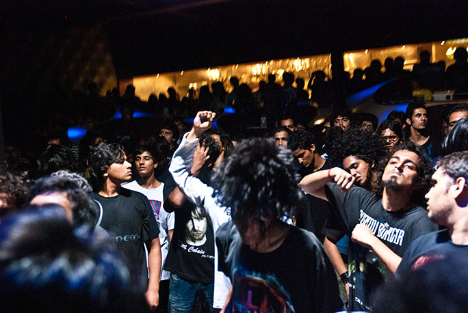

Break-ups are the absolute worst. The agony, heartache and hopelessness that naturally ensues is gut-wrenching, frustrating and morally decapitating. But with cautious certainty, they are almost always for good.

The relationship BlueFROG had with its patrons, staff and family was no exception. For nine long years, the club was the major source of all-things good in our cities growing independent music sub-culture. These nine years saw the venue, with its minimalist, industrial yet futuristic décor, as the torch-bearer for the developing independent music space. It supported artists across the spectrum of genres, and for three days a week paid homage to every conceivable type of musician. From elaborate modular synth sets, to sit-down harp and keys set-ups to six-piece guttural black metal bands – BlueFROG didn’t care. They gave every artist a platform, based on their music and nothing else. They were purveyors of music in its truest manifestation, sans labels and stigmas. But then, it closed its doors.

\[caption id="attachment\_378" align="alignnone" width="684"\] Picture courtesy: Nh7.in\[/caption\]

<!--more-->

Even though my association with the venue and its scathing defiance of the norm was very brief, it was one that has left me a rewarded individual. The entire atmosphere transforms after turning right from Zaffran – the trusted cigarette vendor, sticker-clad walls and thuggish bouncers guarding the entrance to the sacred stage. And, if rumor is to be believed, the artists’ green room is the most hallowed of all institutions. Numerous tall tales about the green room and the shenanigans it breeds have echoed around the scene, leaving us non-musician folk in awe of those who have had the privilege of entering the room.

Forgive the cliché, but everyone has _their_ BlueFROG story. Be it breaking their nose in the mosh-pit or dancing on-stage with the artist, every attendee at every show has their distinctive rendition of their initiation into BlueFROG and subsequently the music scene. My story, however, lacks the romance and charm most others’ possesses. It was a Saturday afternoon, and I was hosting Matteo, an Italian exchange student. It was his first day in town, and he spoke in terribly broken English, so our conversations revolved mainly around women and cigarettes. As Goldspot began their painfully platitude yet endearing set, language seemed inessential. The cozy audience swayed and danced to every chord and as the set built up, country boundaries and nationalities were transcended. Matteo and I had fostered an irrevocable bond through the unlikeliest of mediums – ‘Friday’ by Goldspot. After that fateful Saturday afternoon, BlueFROG became my solace.

The intimate, stripped down setting gave the audience a keen insight into the musicians’ set-up and ensured that the energy would always be palpable. Artists were rarely seen with a straight face, beaming through hour-long sets was commonplace. The most incredible section of every show was – however ‘creepy’ this may sound – turning around and looking at the caliber of fellow audience-members. Regardless of the gig, there would always be a host of other musician’s from the scene watching, analyzing, clapping, dancing and celebrating to their co-workers’ art. It was a humbling experience to watch shows alongside artists I have grown up listening to and love, all of whom were kind enough to have a short-conversation or take a picture with anyone who asked. The atmosphere was literally like that of a dysfunctional family reunion, with excessive alcohol, dancing and boundless love.

 

BlueFROG was perhaps the only venue in the city that prioritized the needs of the artist above that of their customer. It is also the spawn point of all things good for the industry, and as the wall of photographs suggests the venue of choice for the most famed of international artists. Even with the proliferation of other bars and clubs that are clearly taking away the FROG’s business, it will remain unparalleled within us all. Similar to Rangbhavan and Raspberry Rhinoceros, BlueFROG will not fade into oblivion; it will remain a semblance of diversity, homeliness and happiness. Discounting the gestation period before BlueFROG is back on the map, it is safe to say that there is nothing that the music scene waits for with such bated breath.
