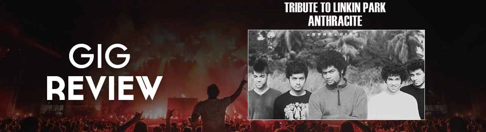

_**A review of the first tribute to Linkin Park in India. Original article can be found [here.](http://www.chordsunited.com/blog/reviews/2/42/1/gig-review-linkin-park-tribute-by-anthracite.html)**_

Waking up the morning after a gig with a searing ache in your neck from the head banging and sounding hoarse as can be, but enveloped in a euphoria like none other has happened but once before to me (See : Big69), up until I descended upon Hard Rock Café Mumbai for Anthracite’s tribute to Linkin Park. The following review is inevitably going to be rife with cliché and cheesiness reserved usually for Justin Timberlake songs, but Linkin Park is more than a band; they are a social institution.

Every memory associated with the band is imprinted in my mind – be it listening to my first Linkin Park song, Faint, aged 7 on the way back from football practice or writing the lyrics to Somewhere I Belong in my 5th standard Singing book, the band has been an essential component of both my musical and non-musical journey. The Linkin Park anecdotes would most definitely suffice a blog in themselves, with stories ranging from handrawn posters of the band put up all over my room, ordering bootleg CDs from abroad and breaking down as a friend of mine convinced me that Chester was suffering from throat cancer.

<!--more-->

When the tribute was announced, more than utter excitement at it being a Linkin Park tribute, I was incredibly pleased to see that it would be Anthracite who would be the band covering LP. While not the biggest fan of other nu-metal bands, Anthracite’s record ‘Groove Sandwich’ remains at the apex of my pick of local metal albums. It was imperative that the band paying tribute understood the ethos and components that make up Linkin Park, something that is not a small ask.

Prior to the beginning of the show, the band huddled together on-stage, but no pep-talk would be able to prepare the band for the madness that was to ensue. The venue was packed, with expectations and energy running high, most of which was not, surprisingly, alcohol induced. The band opened with the familiar sample of ‘Faint’, with vocalist Abhishek charismatically pulling off Mike Shinoda-esque vocals (and wadrobe). Deep, on the bass, introduced the crowd to the night’s first breakdown, with a haunting growl. The songs that followed were a collection of superbly well-reharsed guitars, with Sahil and Siddharth perfectly in sync with one another, exchanging rhythm and lead duties from time to time. Deep and Dev, used their ‘twin-chemistry’ to construct an airtight rhythm section which held the entire performance in place, while also handling backing-vocals. While all five of the aforementioned musicians did smash any expectations I had, it was Mehar Chumble who stole the show. His control over the samples, synthesizers and keys through the performance and his calm, baby-faced demeanor took the gig to the next level. What distinguishes Linkin Park from other live acts in the genre is their insurmountable ability to incorporate electronics into their live shows, something that is near impossible to replicate. Yet somehow, Anthracite and Mehar managed to do so, note to note, sample to sample.

The band ran through a set-list that borrowed most of its songs from older parts of Linkin Park’s catalogue, mainly from Meteora and Hybrid Theory. ’Points of Authority’, ‘Don’t Stay’ and ‘Somewhere I Belong’ where played with the requisite ferocity and dexterity, with ‘offs’ and extended breakdowns being used intelligently by the band. ‘Shadow of the Day’ was the first song played of ‘Minutes to Midnight’, which was followed by live classics such as ‘Papercut’ and ‘Lying from You’. While sections of the audience were evidently disappointed with the lack of newer material being played, the rest of the crowd was oblivious. Every word, every scream and every growl was emulated by the crowd whose inebriation was not alcohol based. ‘Breaking the Habit’ was performed by the band’s friend Rishabh, who after that performance, found a fan-following for himself.

A short intermission saw me walk by vocalist Abhishek and out of sheer panic bow down to him and fold my hands. For the first time at a gig, I was reduced to a giggling, overwhelmed ‘fan girl’. As the band made their way back on-stage, the set-list began to diversify with obscure EP material (Qwerty) being played, which was followed by the ‘lighter song’ (Leave Out All the Rest), all of which was played to an enraptured audience. Guitarists Sahil and Siddharth regularly looked disinterested, a stark contrast to Deep on the bass whose billowing hair was being flung all over the stage. Vocalist Abhishek’s reference to his girlfriend was met with a lot of jealous faces in the audience, as his stage presence mirrored that of Mike Shinoda, but his vocal repertoire surpassed that of Mike’s. His ability to emulate scratching sounds with his mouth was something that distinguished the performance from other covers.

As the night grew older, the only song played from the band’s last three albums (thankfully) was the powerful ballad ‘Iridescent’. When Abhishek announced that only three songs were left, speculation on all fronts began – with large parts of the audience convinced that ‘Numb’ and ‘In the End’ would be played. As Mehar played the introductory pad notes of ‘Numb’, the already bewitched audience came together in unison to impeach Abhishek as vocalist, and take on his duties instead. ‘Numb’ faded into ‘In the End’, with the haunting piano notes and scratching sample being interrupted by Abhishek’s call to the audience to sing Chester’s part (see : Road to Revolution), which was willingly embraced by the crowd, which was clearly familiar with one of the band’s most iconic tracks. The fervor with which every person present at the venue came together and bellowed out the final verse of ‘In the End’ was ethereal. The final flurry of piano notes which were perfectly emulated by Mehar left a small void in the atmosphere, with the crowd waiting in disbelief for what could possibly top the previous performance. To my utter joy, Abhishek proclaimed that this would be the ‘last chance to rock with us’, and from that moment on I knew that there could be only one song the band could close with – ‘One Step Closer’. A song that epitomized the childhood of millions of fans across the globe began with its monumental riff which was layered with the angst-filled vocals and guitar scratches. As the song approached its most definitive section, two of the most disappointing things of the night took place. First, the lack of a mosh-pit and second, that the band did not play the extended live-bridge section. As the words ‘Shut up when I’m talking to you’ rang across the venue, absolute chaos reigned with squeals, pushes, jumps, hugs and kisses all present. Every modicum of sanity was thrown out the window, both on-stage and off-stage with the crowd and the band bouncing in coordination with one another.

The unsatisfied crowd cheered the band on to an encore, which was slightly anti-climactic as they had not prepared another song to perform. Slight hesitation and apprehension was evident among the band members, as was a fatigue that was over-powered by the stupendously high levels of dopamine in their systems. While my requests for a Rage Against the Machine cover were met with looks of disapproval from my friends, the band played ‘In the End’ in the end, capping off a memorable night in all respects.

Anthracite did the seemingly impossible – successfully and accurately covering Linkin Park. From the scratches on the post-chorus of ‘Papercut’ to the muted drums on the build-up of ‘What I’ve Done’, every section of every song was perfected. Anthracite proved themselves to be a well-rehearsed, dedicated and down to earth band. The knowledge and emotion toward the band that they exuded was evident, as allusions and references to previous live performances were used. It was clear that the band had an emotional connection with Linkin Park, which they channeled through 100 blissful minutes.

While tribute shows are something that a ‘hardcore indie scene’ member should be averse to (as it takes away from the popularity of the local band and perpetuates the stigma against original work), they do, at some level, promote local bands and their music. Regardless of the show’s effect on the music industry, the show’s effect on me was transcendental in more ways than one, with inexplicable joy being a huge understatement. A Linkin Park show in India may be a long-shot, but Anthracite more than made up for the band’s absence.
