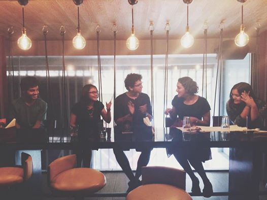

_**A synopsis of a monthly open-mic night I help organise. Original article can be found [here.](https://campusdiaries.com/stories/open-sky-open-mind)**_ 

_**Another article about the event can be found [here.](http://baysidejournal.com/wp/come-to-open-sky-slam-where-anyone-can-showcase-their-talents/)**_

Finding a place where you aren’t labelled by the books you read or the way you speak or the colour of your hair has become something of a myth, yet somehow the Open Sky Slam does just that. Tucked into the heartland of metropolis’, this event unites people who have the ability, the gift to look beyond what meets the eye.

Far enough from the chaos of everyday life to feel liberated yet not far enough to feel disconnected, the Slam in Mumbai was held at Cross Maidan. Situated in the artsy locale of Churchgate the venue was almost built for events like this with lush green glass and loosely placed benches that provided both artist and audience alike with the perfect surroundings. The sweltering heat did not dampen the spirits of anyone present there, for there was a unique energy that enveloped the air.

On the afternoon of the twenty sixth of April, sixty-odd figures armed with an arsenal of art assembled together. Over the next evening, the life of every one of these indivuals was altered in some way or the other. Whether it was giving someone a platform to voice their opinion about democracy or being the catalyst for someone’s first ever public performance, the Open Sky Slam proved to be more than your typical Open Mic Night. Amongst the plethora of talent were poets, musicians, comedians, or more accurately there were dreamers, visionaries and revolutionaries. <!--more-->As the evening unravelled out came riveting poems and captivating music. Themes such as helplessness, lost love and politics were elucidated through the most beautiful of metaphor.

Each artist was encouraged by the undivided and complete attention of every member of the congregation whose cheers, “oooohs”and “aaahs” echoed the sentiment of the words being recited. Nervous energy transcended into sheer exuberance as each performer, no matter how seasoned felt a little high that cannot be articulated. Amongst the highlights of the evening was a poem condemning democracy, a piece of stand-up mocking today’s world and a riveting rendition of ‘A Thousand Years’. In the brief interval, a member of the audience sold her homemade brownies which were symbolic of the evening as a whole: fantastic.

More than a showcase of talent, the Open Sky Slam proved to be the perfect place to network with like-minded people. Numbers were exchanged, hugs were shared and friendships were forged as every person present there was united by a unique bond.

Everyone present knew that they no longer were just teenagers who had a passion for art, they were part of something bigger, part of an event that had no regard for any sort of judgement, an event where you were looked at for the person you were, an event where you could be the person you truly were without society or anyone else telling you that that was wrong, an event where you belong.
