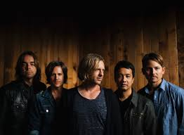

My first show review, alt-rock band Switchfoot. Original article can be found [here.](http://whatsthescene.com/gig/switchfoot-at-hard-rock-cafe-worli/)

Ever since alt-rock pioneers Switchfoot announced their three city India tour, the air and the airwaves had this tinge of nostalgia, ecstasy and excitement. The organisers were flooded with Facebook posts demanding tickets at the earliest, asking about merchandise and other seemingly trivial queries about our generations most groundbreaking bands. Tickets sold out instantaneously, leaving a large share of the fan base without access to an opportunity that does arise but once in a lifetime.

The day of the gig saw fans waiting outside the venue hours before the gates were scheduled to be open, ensuring that they would be the first to see their idols play songs that defined their childhoods.  As the gates opened, people began pouring in and after initial hesitancy the entry process was quite smooth and well-organised. The atmosphere inside the venue was electric – with tantalising food and free-flowing drinks, the entire crowd sang along to every song played, even before the actual band came on. The mere sight of the sound technician adjusting the instruments set the crowd into frenzy, with banners and posters being waved vociferously. The venue was packed; there was no space to fit in another soul, testament to the band’s popularity in the subcontinent. Any apprehension about the venue being too small or the tickets being too expensive were quelled as it resulted in the audience comprising of only die-hard fans, committed and invested in the band’s work that has spawned 9 albums.<!--more-->

As the lights dimmed and on came Switchfoot, the excitement of the crowd could not be contained. Grown men were reduced to fan girls, screaming, waving their hands and jumping at every enunciated word. Through the band’s set, which was beautifully crafted to ensure songs from their entire repertoire of hits were played, the crowd remained hysteric. Even the discerning fan was absorbed into the performance with the likeability of the music, it’s easy to listen to yet engaging riffs and melodies brought smiles on to the faces of every member of the crowd.  All the expectation, anxiety and excitement of the audience transcended into the band, who fed of this energy effortlessly.

Perhaps the most spellbinding feature of the set was the ability of Jon, the vocalist, to connect with the crowd. Every song had an “ooh-aah”segment that had everyone following his lead religiously. His stage-dives, high fives and Tarzan-esque climbing added dynamicity and proved to be the difference from a show and a spectacle. From “Meant to Live”, to “Dark Horses”, the audience was truly “one” with the band. The drummer of the band, Chad, celebrated his birthday by playing a dholak and his first game of cricket. Jon’s reference to India’s forthcoming cricket game was received with laughter and unanimous cheering. The set was sprinkled with just the right amount of ballads, guitar-heavy songs and crowd pleasers, just showing us how capable they were as showmen.

Reflecting on a night where 500+ people were in unison with 5 men from halfway across the world, Switchfoot truly lived up to every expectation possible, bringing back images of our childhood and reminiscing about college and simpler days. Switchfoot undoubtedly are, one of the most capable performers and songwriters of our time.
