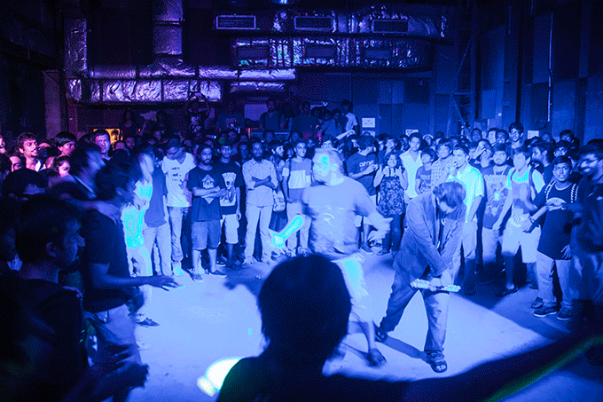

Late last night, three of my friends and I sat on the footpath outside Todi Mills, drinking chai and eating biscuits. We sat there bereft of words yet filled with this inexplicable gratification. One of my friends dabbed his nose continuously, curbing the blood flow with paper towels. Another lamented his decision to wear chappals, and the third squeezed a combination of someone else’s beer and (hopefully) his sweat on to the curb. Yet, they all smiled, for earlier that night they had all been inflicted with a heavy dose of the mosh-pit.

While I flaunted my relative mosh-pit experience to them gleefully, no amount of exaggerated stories could prepare anyone for the sheer jubilation that one feels when in a mosh-pit. It sounds suicidal almost, on paper – people throwing themselves at one another, pushing, head banging and screaming. The mosh-pit, however, is a spiritual experience. Few things are as cathartic as being speared by a massive black-clothed man into a swarm of other massive black-attired men, and then finally finding yourself on the shoulders of one of them. The sheer camaraderie and familial love that flows from person to person is what makes live music what it is – a medium that connects people across social boundaries and divisions.

> [A video posted by Arnav Sheth (@arnavmcr)](https://www.instagram.com/p/9iqXaXOKkL/) on Nov 1, 2015 at 4:06am PST

 

<!--more-->

The mosh-pit doesn’t discriminate. Along with death, it is the ultimate equalizer. The last purely metal show at BlueFROG with Dirge, Last Ride Home, Noiseware and Bhayanak Maut saw the most unlikely of entities at the heart of the pit. A man confined to his wheelchair – decked out in his black t-shirt was spotted vociferously headbanging through all four sets. He was brought on stage to a rapturous audience, one who resonated and acknowledged his incredible love for music. Next up, was a kurta-clad lady, who at first seemed content with air-guitaring and headbanging, but with the onset of Bhayanak Maut took no prisoners. She was seen storming across the pit in her stilettos with the widest imaginable grin, which was reciprocated by the usual suspects – who were initially perturbed. The aforementioned usual suspects comprise the beefy men wearing black band t-shirts, usually with album covers of Dimmu Borgir, Judas Priest or, as was the case last night, Bhayanak Maut. These imposing figures are, in reality, the jolliest people you will ever meet. Even though they will push the hardest and scream the loudest, they will be the first to pick you up if you fall and will then do an intermittent jig before the next breakdown hits. They are the regulars, the tenants of the mosh-pit who always welcome young, fresh blood.

Everyone has their mosh-pit story, their badass memory when the usual level of crazy shoots through the roof, that one moment when the breakdown of your favorite song hits and you forget all sense of being and immerse yourself wholly in the harmonious polygamous unison of a family unlike any other. There is a part of me that wishes that I had that incredible story, where I was carried by the frenzied crowd – but unfortunately, my first interaction with the mosh-pit was rather anti-climactic. It was during a show at Sitara Studio, and the Lightyears Explode were playing their iconic Kunj Gutka. Completely out of the blue, I saw the entire crowd fold in on itself and partake in the most, at the time, ludicrous act I had set my eyes on. My aunt, who had brought me to the show, dove in front of the crowd and rescued my frail 13 year old body from the onslaught. Thus began my fascination with the pit.

\[caption id="attachment\_media-4" align="alignnone" width="680"\] The sacred first mosh-pit. Picture credits: Nh7.in\[/caption\]

The thankless job the mosh-pit undertakes has been romanticized in the past, but from the boys with bleeding noses, bruised feet and drenched clothes; this is our ode to you.
