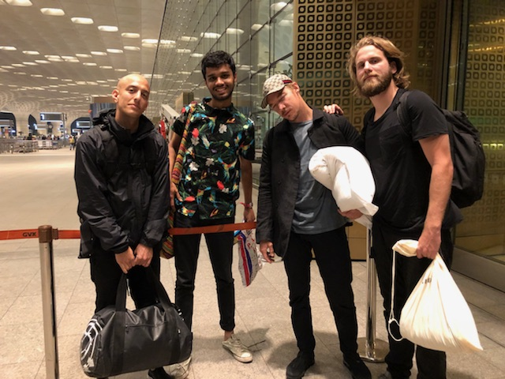

Probably one of the most dizzying, electrifying and enthralling weekends of my life, Vh1 Supersonic 2018 was an absolutely incredible experience.

I worked as an artist liaison to Diplo (of Major Lazer fame) and Marshmello. I was responsible for all aspects of their hospitality, right from picking them up from the airport to their hotel and even to sightseeing and eating.

\[caption id="attachment\_710" align="alignnone" width="640"\] L-R: Adam Elmakias (incredible music photographer), me, Diplo, Luke (Diplo's manager)\[/caption\]

Through the weekend, I honed my **decision-making** skills due to the high-intensity nature of the event. It also enabled me to understand the **structure of teams** better and taught me that in most team situations, less can often mean more - and letting go can often yield the best results. Liasioning required **meticulous planning** and **time-management** skills, coupled with a knack for conversation and **people-skills**, all of which were developed and tested through the most memorable and enriching weekend I have ever experienced.
